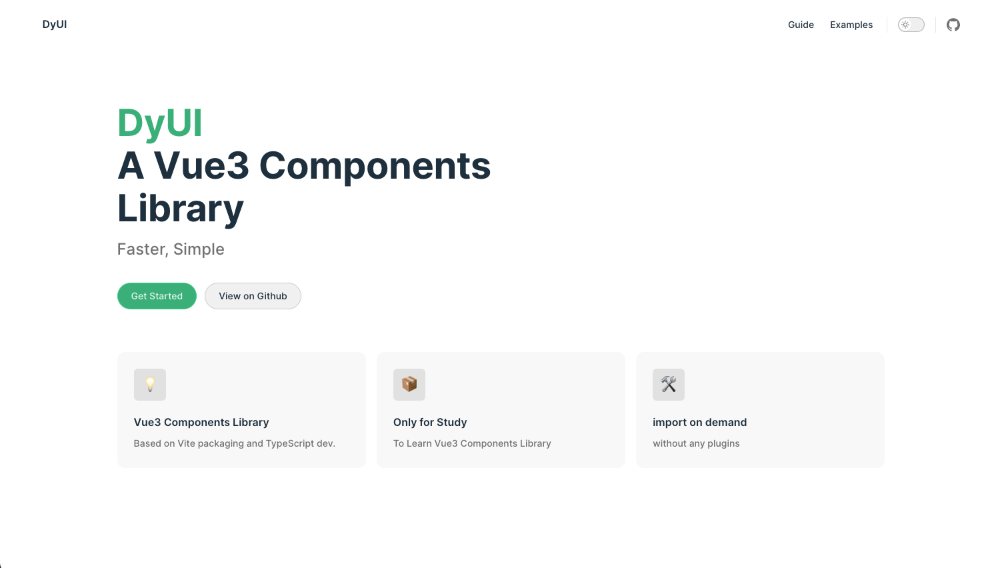

# Vue3 UI components project using monorepo

## Monorepo envrioment

### 1. Global install pnpm

    npm install pnpm -g

### 2. init package.json

    pnpm init

### 3. setup .nmprc

    shamefully-hoist = true

## Monorepo implement

### pnpm-workspace.yaml

    packages:
    - 'packages/**'
    - 'examples'

## install project dependences

> 'packages' folder to store dev packages; \
> 'examples' folder to debug our components

    pnpm i vue@next typescript less -D -w

### tsconofig.json

    npx tsc --init

tsconfig.json:

    { 
      "compilerOptions": {
        "baseUrl": "./",
        "jsx": "preserve",
        "strict": true,
        "target": "ES2015",
        "module": "ESNext",
        "skipLibCheck": true,
        "esModuleInterop": true,
        "moduleResolution": "Node",
        "lib": ["ESNext", "DOM"]
      }
    }

## create a vue3 project using vite

    cd examples
    pnpm init
    pnpm install vite @vitejs/plugin-vue -D -w

### vite.config.ts

    import { defineConfig } from 'vite'
    import vue from '@vitejs/plugin-vue'
    export default defineConfig({
      plugins:[vue()]
    })

### index.html

    <!DOCTYPE html>
    <html lang="en">
    <head>
      <meta charset="UTF-8">
      <meta http-equiv="X-UA-Compatible" content="IE=edge">
      <meta name="viewport" content="width=device-width, initial-scale=1.0">
      <title>DyUI</title>
    </head>
    <body>
      

      
    </body>
    </html>

### app.vue

    <template>
      

        Hello DyUI🎨
      

    </template>

### main.ts

    import {createApp} from 'vue';
    import App from './app.vue';

    const app = createApp(App)

    app.mount('#app')

### package.json

    ...
    "scripts": {
      "dev": "vite"
    },
    ...

## run project

    pnpm run dev

---------------------

    -- packages
      - utils
      - components

## utils

    cd utils
    pnpm init

package.json:

      {
        "name": "@dy-ui/utils",
        "version": "1.0.0",
        "description": "",
        "main": "index.ts",
        "scripts": {
          "test": "echo \"Error: no test specified\" && exit 1"
        },
        "keywords": [],
        "author": "",
        "license": "ISC"
      }

## components

    cd components
    pnpm init

package.json

    {
      "name": "dy-ui"
      "version": "1.0.0",
      "description": "",
      "main": "index.ts",
      "scripts": {
        "test": "echo \"Error: no test specified\" && exit 1"
      },
      "keywords": [],
      "author": "Dy",
      "license": "ISC"
    }
